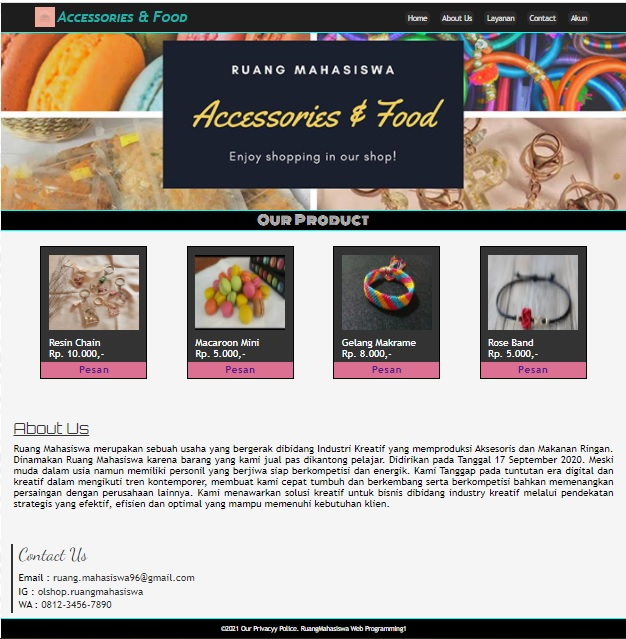
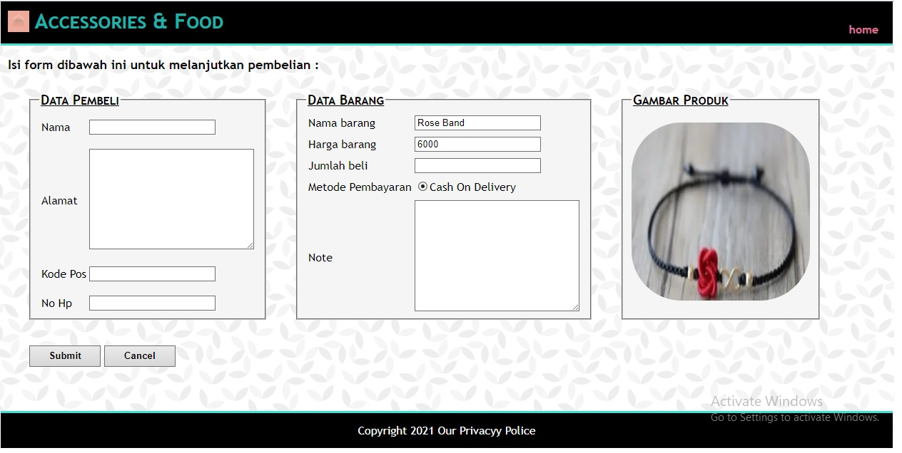

# Accessories & Food

## 1. Tema Project

Tema Project yang kami dapatkan adalah **Produk UMKM**.

## 2. Keunggulan

Untuk keunggulannya sendiri yaitu terletak pada fitur pemesanan , di website kami sudah tersedia fitur untuk memesan barang dengan tekan "Pesan" pada bagian produk, maka kalian akan langsung diarahkan menuju "Form" pemesanan.

## 3. Penjelasan Project

Website ini dibuat dengan tujuan mengatasi masalah penjualan disaat pandemi. Dengan adanya website ini , tidak perlu takut untuk membeli barang

### Anggota Kelompok :
- 19200636  Nina Nursalsabila
- 19200672  Julian Rifaldi
- 19201068  Muchammad Vico Airlangga
- 19200351  Wahyu Andhika

## Fitur-Fitur yang tersedia :

**1. Layanan, pada fitur ini pembeli sudah bisa memberikan keluhan / saran terhadap produk yang dijual serta pembatalan pesanan**

**2. Form Pemesanan, untuk fitur pemesanan ini juga sudah tersedia output berupa struk transaksi/pembelian yang dilakukan.**

**3. Web Responsive, memungkinkan pengguna untuk mengakses melauli Smartphone**

**4. Tombol Pencarian Produk, dibuat untuk memudahkan pengguna mencari barang yang dinginkan**

### Berikut Tampilan Website yang kami buat :

1. Halaman Awal

2. Form Input Pemesanan

